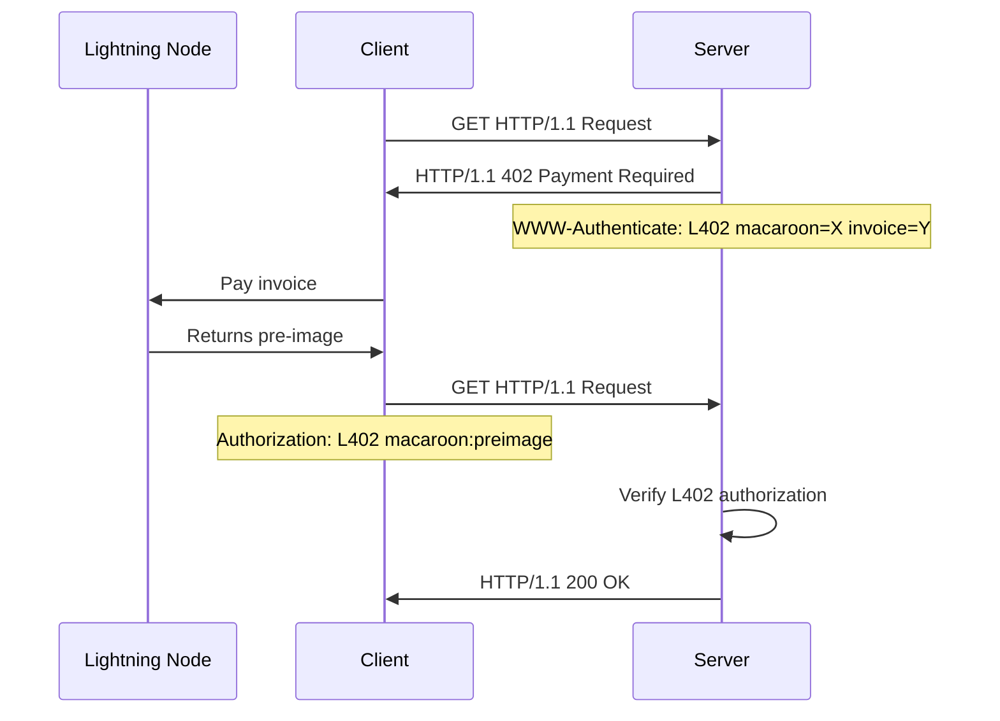

```
bLIP: 26
Title: L402: The Lightning HTTP 402 Protocol
Status: Active
Author: Olaoluwa Osuntokun <laolu@lightning.engineering>
        Oliver Gugger <guggero@lightning.engineering>
        Wilmer Paulino <wilmer@wilmerpaulino.com>
Created: 2023-06-06
License: CC0
```

* [Abstract](#abstract)
* [Copyright](#copyright)
* [Motivation](#motivation)
  * [Example Applications and Use Cases](#example-applications-and-use-cases)
* [Rationale](#rationale)
* [Specification](#specification)
  * [Authentication Flow](#authentication-flow)
    * [Reusing Credentials](#reusing-credentials)
    * [Security Considerations](#security-considerations)
  * [L402 HTTP/gRPC Protocol Specification](#l402-http/grpc-protocol-specification)
    * [Server HTTP Authentication Headers](#server-http-authentication-headers)
    * [Client HTTP Authentication Headers](#client-http-authentication-headers)
    * [HTTP Protocol Flow Specification](#http-protocol-flow-specification)
      * [Server Flow](#server-flow)
      * [Client Flow](#client-flow)
    * [gRPC Protocol Specification](#grpc-protocol-specification)
      * [Server Flow](#server-flow)
      * [Client Flow](#client-flow)
* [Universality](#universality)
* [Backwards Compatibility](#backwards-compatibility)
* [Appendix](#appendix)
  * [Macaroon Minting & Verification](#macaroon-minting-&-verification)
    * [Minting Macaroons](#minting-macaroons)
      * [Macaroon Identifier](#macaroon-identifier)
    * [Attenuation Through Caveats](#attenuation-through-caveats)
      * [Target Services](#target-services)
      * [Service Capabilities](#service-capabilities)
      * [Service Constraints](#service-constraints)
    * [Macaroon Verification](#macaroon-verification)
    * [Macaroon Revocation](#macaroon-revocation)
* [Reference Implementation](#reference-implementation)

# Abstract

L402 is a protocol standard based on the HTTP 402 Payment Required error code
and macaroons designed to support the use case of charging for services and
authenticating users in distributed networks. The L402 protocol is a concrete
instantiation of a Lightning Network based micro-paywall for HTTP/gRPC APIs on
the web. A supporting server signals that a payment is required for an endpoint
by sending a special `WWW-Authenticate` header along with a 402 status code.
This header encodes the macaroon (L402 API key), and a Lightning Network
invoice. In order to traverse the L402-enabled endpoint, the client then pays
the Lightning Network invoice, and presents the `(macaroon, pre-image)` tuple
to the server in their next request via an HTTP `Authorization` header.
Critically, the L402 macaroon cryptographically commits to the payment hash of
the LN invoice sent by the server proxy. This commitment structure enables the
server to easily verify that a client has properly paid for the endpoint in a
stateless manner.

In addition to being a standardized, structured cryptographic bearer
credential, macaroons enable delegation as well as attenuation of capabilities.
A supporting proxy can encode authentication and capability details in the
macaroon as structured data, with the older of a macaroon able to delegate the
macaroon to other users, and even attenuate or restrict the set of permitted
capabilities.

The L402 protocol can be implemented as a simple reverse-proxy in front of a
traditional HTTP/gRPC based backend. The proxy handles the minting +
verification of the L402 macaroon credentials, decoupling the authentication
layer from the target web service backends. In more advanced deployments, a
backend may introspect into the L402 macaroon structure to enforce capability
verification, and even dynamically communicate with the proxy to dictate
real-time pricing in an automated fashion.

The L402 protocol get its name from the HTTP status code 402: Payment Required. 

# Copyright

This bLIP is licensed under the CC0 license.

# Motivation

The early creators of the Web created a cut out for a future Internet-native
payment system in the form of the HTTP 402 Payment Required status code. This
status code was intended to be returned if payment was required in order to be
able to fetch/interact with the resources at a given HTTP endpoint. The 402
status code thus presented a way to enable HTTP-native payment metered APIs on
the Web. The rise of the Transport Layer Security protocol, enables payments on
the Web, albeit via client-side interfaces that rely on opaque payment networks
such as credit cards. With the rise of Bitcoin, and the Lightning Network, the
Internet now has a native digital currency and a low-cost, low-latency, high
volume payment system to enable highly scalable payments over open payment
infrastructure.

This document specifies the L402 protocol which utilizes the 402 status code,
macaroons, the Lightning Network, and special authorization headers to create a
native payment-metering system for the Web. An L402 credential can serve both
as authentication, as well as a payment mechanism \(one can view it as a
ticket\) for paid APIs. By leveraging L402, a service or business is able to
offer a new tier of paid APIs that sit between free, and subscription: pay as
you go.

One can view L402 credential (a macaroon) as a fancy authentication credential
or cookie. They differ from regular cookies in that they're a cryptographically
verifiable bearer credential. An L402 credential _encodes_ all its capabilities
within a macaroon which can only be created by the end service provider. The
L402 specification uses a combination of `HTTP` as well as the Lightning Network
to create a seamless end-to-end payment+authentication flow for the
next-generation of paid APIs built on top of the Lightning Network.

## Example Applications and Use Cases

The L402 standard enables a number of new use cases, pricing models, and
applications to be built, all using the Lightning Network as a primary money
rail. As the standard is also defined over _HTTP/2_, it can be naturally
extended to also support gating access to existing _gRPC_ services. This is
rather powerful as it enables a _strong decoupling_ of authentication+payment
logic from application logic. Today Lightning Loop uses L402s in this very
manner to provide a lightweight authentication mechanism for our users.

As L402 leverages the Lightning Network for its payment capabilities, they also
enable the easy creation of _metered_ APIs. A metered API is one where the user
is able to pay for the target resource or service as they go rather than
needing to commit to a subscription up front. Developers can use L402 to create
applications that charge users on an on going basis for resources like compute
or disk space. If the user stops paying, then the resource can be suspended,
collected, and re-allocated for another paying user. Once again, as the
standard supports _gRPC_ which supports _bi directional streaming_ APIs, one
could even create a metered streaming video or audio service as well!

Additionally, L402 also enables innovation at the API _architecture_ level. One
example is automated tier upgrades. Many APIs typically offer several tiers
which allow users to gain access to more or additional resources as they climb
up the ladder. Typically, a user must _manually_ navigate a web-page to request
an upgrade to a higher tier, or downgrade to a lower tier. With the L402
standard, tier upgrades can easily be automated: the user hits a new endpoint
to obtain an _upgraded_ L402 which _encodes_ additional functionality or
increased resource access compared to the prior tier. Services can even
leverage L402 for A/B Testing by giving subsets of users a distinct L402 which
when submitted to the service, render a slightly different version of the
target resource or service.


# Rationale

# Specification

## Authentication Flow

This section explains the high-level authentication flow from the perspective
of a user and their client software.

This diagram outlines the high level authentication flow for the protocol:


HTTP-based protocol flow:

1. A client hits an `HTTP` endpoint to fetch a resource.

2. The server decides that payment is required to access the endpoint. They
   return a HTTP status code of `402` along with a `WWW-Authenticate` header
   containing a macaroon and invoice. The macaroon commits to the payment hash
   of the invoice `H`.

3. The client pays the invoice over the Lightning Network and receives the
   payment pre-image `r` to the payment hash `H`, `H = sha256(r)`

4. The client re-issues the request with a `Authorization` header that includes
   the payment preimage `r`, and the macaroon sent by the server.

5. The server verifies the cryptographically verifies the authenticity and
   integrity of the macaroon, then ensures the payment hash committed to in the
   macaroon `H`, satisfies the relation the `H = sha256(r)`.

6. The server returns a 200 OK error code along with the specified resource.

If the service supports persistent L402 credential re-use, then a client SHOULD
store the credential as it can be re-used without repeating the initialization
step. As seen below, credentials can be easily revoked by the server, expire,
and even contain structured information that encodes the capabilities of a
credential.

### Reusing Credentials

L402 is intended to be reused until they are revoked and the server issues a
new challenge in response to a client request containing a newly invalid L402.
Possible revocation conditions include: expiry date, exceeded N usages, volume
of usages in a certain time period necessitating a tier upgrade, and
potentially others \(discussed further in the higher-level design document\).

L402 could be configured for use on a per-backend-service basis or for all
exposed services. As an example, the same L402 credential may commit to
capabilities enabling a user to access both service `Y` and `X from the same
endpoint. This flexibility is afforded because all services are going to be
gated by the same L402 proxy, which verifies all macaroons for all backend
services.

### Security Considerations

If a client’s L402 is intercepted by Mallory, which is possible if the
transmission is not encrypted in some way such as TLS, the L402 can be used by
Mallory and the L402 proxy would not be able to distinguish this usage as
illicit.

L402 authentication is also vulnerable to spoofing by counterfeit servers. If a
client slightly mistypes the URL of a desired backend service, they become
vulnerable to spoofing attacks if connecting to a server that maliciously
stores their L402 and uses it for their own purposes. This attack could be
addressed by requiring the user of the L402 to have a specific IP address.
However, there are downsides to this approach; for example, if a user switches
WiFi networks, their credential becomes unusable.

## L402 HTTP/gRPC Protocol Specification

### Server HTTP Authentication Headers

In order to signal that L402 authentication is required, the server sends a
[RFC-7235](https://datatracker.ietf.org/doc/html/rfc7235#section-4.1)
authentication challenge. A challenge takes the form of:
```
WWW-Authenticate: challenge
```

For the L402 protocol the challenge takes the following form:
```
L402 macaroon="X", invoice="Y"
```

where:

* `Y`: is the Lightning Network invoice a client MUST pay in order to obtain
  a pre-image required to complete the `Authenticate` header.

* `X`: is the macaroon credential that encodes the client's capabilities, and
  also cryptographically commits to the payment hash `H` of the invoice `Y`.

### Client HTTP Authentication Headers

This section defines the client-side L402 authentication headers, which
transmits credentials as `<macaroon(s)>:<preimage>` pairs, where the preimage
is encoded as hex and the macaroon is encoded as base64. Multiple macaroons are
base64 encoded individually and listed comma separated before the colon.  

The L402 authentication scheme is based on the model that the client needs to
authenticate itself with a macaroon and invoice preimage for each backend
service it wants to access. The server will service the request only if it can
validate the macaroon and preimage for the particular backend service
requested.

The L402 authentication scheme utilizes the Authentication Framework specified
in [_RFC 7235_](https://tools.ietf.org/html/rfc7235) as follows.

In challenges: the scheme name is "L402". Note that the scheme name is
case-insensitive. For credentials, the syntax is:

`macaroons` → [_&lt;base64 encoding&gt;_](https://tools.ietf.org/html/rfc3548#section-3), comma separated if multiple macaroons are present
`preimage` → [_&lt;hex encoding&gt;_](https://tools.ietf.org/html/rfc3548#section-6)
`token` → macaroons ":" preimage

Specifically, the syntax for "token" specified above is used, which can be
considered comparable to the [_"token68"
syntax_](https://tools.ietf.org/html/rfc7235#section-2.1) used for HTTP basic
auth.

A valid client authorization header takes the form:
```
Authorization: L402 macaroon:preimage
```

### HTTP Protocol Flow Specification

In this section, we specify the protocol for the HTTP portion of the L402
proxy.

#### Server Flow

Upon receipt of a request for a URI of an L402-proxied backend service that
lacks credentials or contains an L402 that is invalid or insufficient in some
way:

1. Ths server SHOULD derive a economical price for the endpoint expressed in
   milli-satoshis (1/1000th of a satoshi) and create a BOLT 11 invoice `P`
   requesting that amount to its backing Lightning Node.

2. The server MUST create a new authentiation credential `M` for the client
   that will only become valid once the client pays the LN invoice.

    3.1. The server SHOULD ensure that the authentiation credential commits to
    the payment hash, as this enables fast stateless verification of each
    incoming credential. Otherwise a backend loop up, or a large amount of
    state may be required to validate all past, current, and future
    credentials.

3. The server MUST reply with a challenge using the 402 \(Payment Required\)
   status code. **Officially, in the HTTP RFC documentation, status code 402
   is** [_**"reserved for future
   use"**_](https://tools.ietf.org/html/rfc7231#section-6.5.2)  **-- but this
   document assumes the future has arrived.**

4.  Alongside the 402 status code, the server MUST should specify the
    `WWW-Authenticate` header \([_\[RFC7235\], Section
    4.1_](https://tools.ietf.org/html/rfc7235#section-4.1)\) field to indicate
    the L402 authentication scheme and the macaroon needed for the client to
    form a complete L402.

    A valid response header MUST take the form of:
    ```
    WWW-Authenticate: L402 macaroon="M", invoice="P"
    ```

    An example L402 HTTP response resembles: 

    ```text
    HTTP/1.1 402 Payment Required

    Date: Mon, 04 Feb 2014 16:50:53 GMT

    WWW-Authenticate: L402 macaroon="AGIAJEemVQUTEyNCR0exk7ek90Cg==", invoice="lnbc1500n1pw5kjhmpp5fu6xhthlt2vucmzkx6c7wtlh2r625r30cyjsfqhu8rsx4xpz5lwqdpa2fjkzep6yptksct5yp5hxgrrv96hx6twvusycn3qv9jx7ur5d9hkugr5dusx6cqzpgxqr23s79ruapxc4j5uskt4htly2salw4drq979d7rcela9wz02elhypmdzmzlnxuknpgfyfm86pntt8vvkvffma5qc9n50h4mvqhngadqy3ngqjcym5a"
    ```

    where `"AGIAJEemVQUTEyNCR0exk7ek90Cg=="` is the macaroon that the client
    MUST include for each of its authorized requests and
    `"lnbc1500n1pw5kjhmpp..."` is the invoice the client must pay to reveal the
    preimage that must be included for each of its authorized requests.

Upon receiving an HTTP request with a valid RFC-7235 `Authorization` header as
defined in the Client HTTP Authentication Headers section:

1. The server MUST verify the cryptographic authenticity and integrity of the
   credential.
  1.1. If a credential is invalid, then the server MUST return a 401
  Unauthorized status code.
2. The server MUST parse out the `Authorization` header (`macaroon:preimage`)
   into a `M` the encoded credential, and `r` the payment preimage.
3. The server MUST verify that the BOLT 11 invoice tied to the credential `M`
   has been paid.
   3.1. If the server committed to the payment hash `H` in the credential `M`,
   then they can simply verify that `H = sha256(r)`.
   3.2. Otherwise, the server should verify that the invoice `P` has been paid
   in full.
4. If the invoice has not been paid in full, then the server MUST return an 401
   Unauthorized header. Otherwise, the server SHOULD process the request
   itself, or pass it on to the proxied backend.

Regarding step 3.1 and 3.2, it's imperative that the server ensure that the
invoice has been paid in full before processing the response, or proxying it to
a backend. As stated above, by cryptographically commiting to the payment hash,
the server can implement fast stateless verification of the payment
hash+preimage relation.


#### Client Flow

Upon receiving a valid L402 `WWW-Authorization` header the client:

1. Should verify that the contained BOLT 11 invoice doesn't request an
   excessive amount of Bitcoin.
1.1. If so, then the client SHOULD abandon the HTTP request.
2. After validating the returned BOLT 11 invoice, the client MUST pay the
   invoice over the LN to receive the payment pre-image `r`.
3. The client then constructs a valid `Authentication` header with the
   following form:
   `Authorization: L402 macaroon:preimage`
4. The client then re-issues the original HTTP request with the attached L402
   `Authorization` header.

In other words, to receive authorization, the client:

* Pays the invoice from the server, thus revealing the invoice’s preimage
* Constructs the L402 by concatenating the base64-encoded macaroon\(s\), a
  single colon \(":"\), and the hex-encoded preimage.

Since the macaroon and the preimage are both binary data encoded in an ASCII
based format, there should be no problem with either containing control
characters or colons \(see "CTL" in [_Appendix B.1 of
\[RFC5234\]_](https://tools.ietf.org/html/rfc5234#appendix-B.1)\). If a user
provides a macaroon or preimage containing any of these characters, this is to
be considered an invalid L402 and SHOULD result in a 402 and authentication
information as specified above.

If a client wishes to send the macaroon `"AGIAJEemVQUTEyNCR0exk7ek90Cg=="`
\(already base64-encoded by the server\) and the preimage
`"1234abcd1234abcd1234abcd"` \(already hex encoded by the payee's Lightning
node\), they would use the following header field:

```text
Authorization: L402 AGIAJEemVQUTEyNCR0exk7ek90Cg==:1234abcd1234abcd1234abcd
```

### gRPC Protocol Specification

This section defines the gRPC variant of the L402 authentication scheme. While
gRPC is itself transmitted over HTTP, it uses special trailing headers to
delineate protocol-specific information. In addition, the [gRPC specification
requires that a status code of 200 is _always_ sent in
responses](https://github.com/grpc/grpc/blob/master/doc/PROTOCOL-HTTP2.md#responses).
As a result, the protocol flow is modified slightly to always send a 200 OK
status code, and instead insert the relevent L402 headers as gRPC trailing
headers.

#### Server Flow

The server flow when receiving a URI that lacks credentials or is invalid is
identical to the HTTP protocol flow with the following modifications:

3.1 The server MUST reply with a challenge using the 200 OK status code.
4. Along side normal `WWW-Authenticate` header, the server MUST send the
   following trailing headers:

   * `Grpc-Message: payment required`
   * `Grpc-Status`: 13 # Internal

   As an example:
    ```text
    HTTP/2 200 OK
    Date: Mon, 04 Feb 2014 16:50:53 GMT
    Content-Type: application/grpc
    …
    Grpc-Message: payment required
    Grpc-Status: 13
    ```

#### Client Flow

The gRPC flow for the client is identical to the HTTP flow, with one addition:
3.1. The client MUST also transmit the final macaroon as `Custom-Metadata`,
with a key of "macaroon" and value of the serialized macaroon.

All other gRPC headers and trailers are required as normal; more information
can be found in the [_gRPC over HTTP2
specification_](https://github.com/grpc/grpc/blob/master/doc/PROTOCOL-HTTP2.md).

# Universality

# Backwards Compatibility

The `L402` protocol was formerly known as `LSAT`. In order to preserve
backwards compatibility with clients, anywhere `L402` is used within HTTP
headers or requests, a valid protocol flow with the string `LSAT` should also
be accepted.

# Appendix 

## Macaroon Minting & Verification

In this section, we outline the specification of the macaroon component of a
Lightning API key \(L402\). To recap, an L402 is composed of a macaroon, which
specifies the allowed capabilities of the credential, and a preimage, which
serves as the credential’s proof of payment. Macaroons are perfect candidates
for L402 as they are tamper-proof, support easy rotation, have attributes, and
can even be further attenuated in order for applications that integrate an L402
enabled service to delegate any additional capabilities. We’ll cover how
macaroons are created, attenuated, and verified as part of L402. This chapter
will require an understanding of how macaroons work and how they are useful in
the context of authentication. It may be useful to skim the [introductory
research paper on macaroons](https://research.google/pubs/pub41892/).

### Minting Macaroons

Macaroons have three basic components: a public identifier that maps to a root
key, a list of caveats \(which is how attenuation is achieved\), and a
signature. Minting a new macaroon only requires the public identifier and the
root key it corresponds to.

Each macaroon must have its own cryptographically random root key that must not
be disclosed to prevent forgeability of macaroons. Each root key consists of 32
bytes, which provides a reasonable tradeoff between entropy and size. Root keys
are essential to the verification of macaroons, so they must be stored securely
and reliably.

#### Macaroon Identifier

The key mapping to the secret is the SHA-256 hash of the macaroon’s public
identifier, which contains static information about the macaroon itself. In the
initial construction, the public identifier should include the following in the
listed order:

> Note: All data specified here are encoded in big-endian unless otherwise
> stated.

* **Version** - A version allows for an iterative macaroon design. It must be
  encoded in 2 bytes unsigned integer.
* **Payment Hash** - A payment hash links an invoice’s payment request to the
  macaroon. Once the payment request is fulfilled, the payer receives its
  corresponding preimage as proof of payment. This proof can then be provided
  along with the macaroon to ensure an L402 has been paid for without checking
  whether the invoice has been fulfilled.
* **User Identifier** - A unique user identifier allows services to track users
  across distinct macaroons serving useful in the context of service level
  metering. A user identifier of 32 random bytes is used instead of the
  macaroon's identifier because the latter can be revoked, e.g., in the case of
  a service tier upgrade.


### Attenuation Through Caveats

Caveats are predicates that restrict a macaroon’s authority, as well as the
context in which it may be successfully used. When verifying a macaroon, each
caveat predicate must be evaluated and hold true. Due to their flexibility,
additional context found within the request to a service may be necessary for
proper evaluation.

Caveats of a version 0 macaroon are represented as key-value pairs encoded as a
string where the key and value are separated by a single `=` character. The key
uniquely identifies a caveat and provides context as to how it should be
evaluated, while the value provides context for the evaluation itself. There
aren't any further restrictions on how caveats should be formed, but Lightning
Labs services will mostly impose three types of caveats which are covered
below.

#### Target Services

The target services the macaroon is allowed to access is represented as a
caveat. The caveat key is `services`, while the value consists of a
comma-separated list of target services. Each target service is composed of a
two-tuple consisting of the service name and its tier. Tiers are service
specific and must start from 0, which serves as the base tier. If a specific
service tier has its capabilities and/or constraints updated, there needs to be
a way to detect when a macaroon of the same tier with the now outdated
capabilities and/or constraints is being used. By committing to the service
tier, it is possible to detect such cases and seamlessly upgrade the stale
macaroon \(assuming it is valid\) by revoking it and minting a new macaroon
with the newer capabilities and/or constraints.

When verifying this caveat, if a macaroon is attempting to access a service
that it does not commit to, then it should be considered invalid. If multiple
services caveats exist, then verification should ensure each occurrence of the
caveat restricts more access than the previous.

#### Service Capabilities

Each service can further be restricted by the capabilities the service provides
and these are also represented as another caveat. These caveats have a key
ending in `_capabilities` that is prefixed with the service name, while the
value consists of a comma-separated list of the allowed service capabilities.
This type of caveat allows certain macaroons to only have access to a subset of
a service's features.

If a capabilities caveat for a particular service is not present, then the
macaroon is able to access any capability of the service. If multiple
capabilities caveats exist for the same service, then verification should
ensure each occurrence of the caveat restricts more access than the previous.

#### Service Constraints

Each service can define its own set of constraint caveats for a given tier to
further restrict the capabilities of a macaroon. Each constraint takes the form
of a caveat, where the key is prefixed with the service capability it applies
to, and the remainder of the key includes context for the service on how to
evaluate the constraint. The caveat value specifies the parameters for the
constraint evaluation.

If multiple caveats of the same constraint are found within a macaroon, then
verification should ensure each occurrence of the constraint restricts more
access than the previous.

As an example, a base tier Lightning Loop macaroon with access to a 2 BTC
monthly volume for Loop Out and unlimited volume for Loop In would look like:

```text
identifier:
    version = 0
    user_id = fed74b3ef24820f440601eff5bfb42bef4d615c4948cec8aca3cb15bd23f1013
    payment_hash = 163102a9c88fa4ec9ac9937b6f070bc3e27249a81ad7a05f398ac5d7d16f7bea
caveats:
    services = lightning_loop:0
    lightning_loop_capabilities = loop_out,loop_in
    loop_out_monthly_volume_sats = 200000000
```

Due to the flexibility of the design, a macaroon holder is able to further
attenuate a macaroon if they wish to share it with a third party under more
restrictive permissions. Following the example above, the macaroon holder can
restrict the macaroon’s capabilities to only allow access to Loop In \(and not
Loop Out\) with a monthly volume of 1 BTC by adding the following caveats:

```text
lightning_loop_capabilities = loop_in
loop_in_monthly_volume_sats = 100000000
```

### Macaroon Verification

Verifying a macaroon consists of a three step process and involves two parties:
the minter of the macaroon and the authorizer, which is the service the
macaroon targets. The minter of the macaroon performs signature checks to
ensure the macaroon is valid, while the authorizer ensures the macaroon has the
required permissions to access the service.

The first step ensures a macaroon was minted by the minter and it has not been
tampered with. This is done by computing the HMAC chain of the macaroon,
starting from its root key and identifier, and including any further
attenuation through its caveats to arrive at the terminal signature of the
macaroon. If these do not match, the macaroon is invalid. If there isn’t a
valid root key corresponding to the macaroon, it is also considered invalid.

The second step ensures a macaroon has provided a valid proof of payment
\(preimage\) and is performed by the minter as well. Since macaroons commit to
the payment hash of an invoice, this is a trivial step.

The final step ensures a macaroon is authorized to access a service. This is
done by ensuring the service-specific caveat predicates of a macaroon hold true
for the service being accessed. If only one of these caveats doesn’t hold true,
then the macaroon is invalid. In the case of an unknown caveat, its evaluation
must be skipped by the authorizer as the macaroon holder can further attenuate
the macaroon for other applications.

### Macaroon Revocation

To prevent abusers of a macaroon-based authenticated service, a macaroon should
be able to be revoked. This can be achieved by having the minter remove the
macaroon’s corresponding root key. By doing so, the minter will never be able
to verify the signature of a revoked macaroon, ensuring it will never reach its
targeted service.

Revocation also serves useful when performing a service tier upgrade on a
Macaroon. The prior Macaroon is revoked to ensure only the upgraded one can be
used going forward.

# Reference Implementation

* [Aperture: A gRPC/HTTP authentication reverse proxy using L402s](https://github.com/lightninglabs/aperture)

* [A utility library for working with L402s](https://github.com/Tierion/lsat-js)

* [boltwall: Nodejs middleware-based authentication using L402s](https://github.com/tierion/boltwall)
